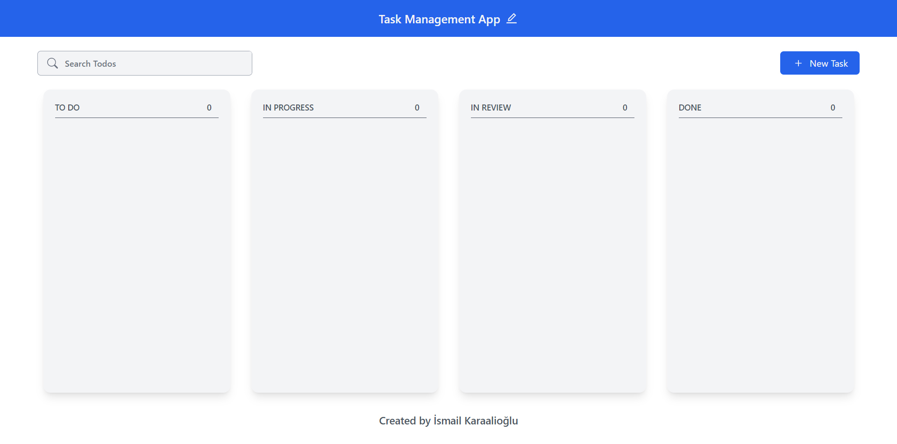
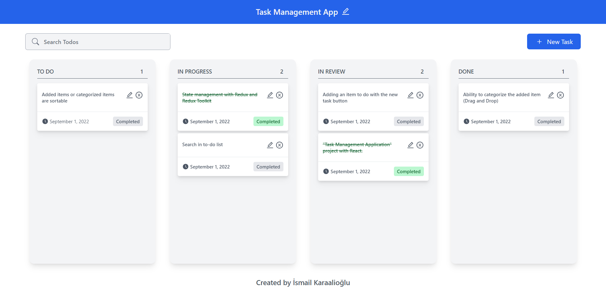

# Task Management App

* "Task Management Application" project with React.

## :sparkles: Live Demo

[https://ismailkaraalioglu-taskmanagementapp.netlify.app](https://ismailkaraalioglu-taskmanagementapp.netlify.app)

## :computer: Setup

1. Clone the repository and install its features.

```
npm install or yarn install
```

2. Use the project locally (localhost).

```
npm start or yarn start
```

## Project Features

:heavy_check_mark: State management with Redux and Redux Toolkit <br />
:heavy_check_mark: Adding an item to do with the new task button <br />
:heavy_check_mark: Search in to-do list <br />
:heavy_check_mark: Ability to categorize the added item (Drag and Drop) <br />
:heavy_check_mark: Added items or categorized items are sortable <br />
:heavy_check_mark: Edit, delete or mark added item as complete <br />

## :fire: Technologies and Libraries

:point_right: React.js <br />
:point_right: Redux <br />
:point_right: Redux Toolkit <br />
:point_right: Tailwind CSS <br />
:point_right: React-Beautiful-DND <br />
:point_right: Classnames <br />
:point_right: React-Icons <br />
:point_right: Moment.js <br />
:point_right: Nanoid <br />
:point_right: SweetAlert2 <br />

## Screenshot


